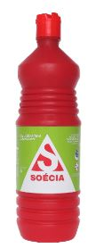

# Banheiro

## Privada:

- Privada:

Para retirar a crosta no fundo da privada:

1- Retire a água da privada. (use panos para sugar toda a água do fundo da privada)
2- Quando a privada estiver seca. 

Use a Solução Ácida Desincrustante Concentrada 1,0L - Soécia

Deixe agir por 1 a 2 dias.

CUIDADO: Tranque o banheiro e não inale os vapores
